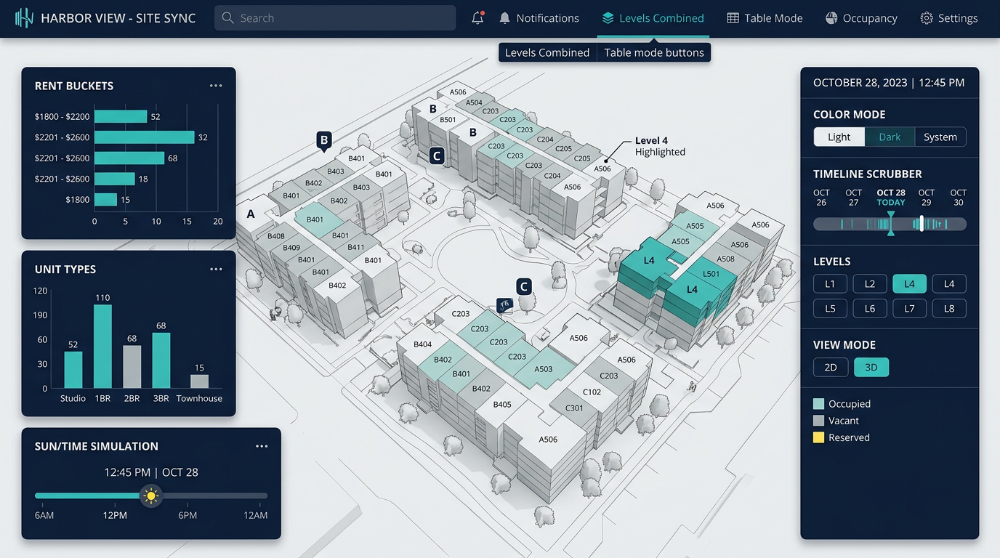
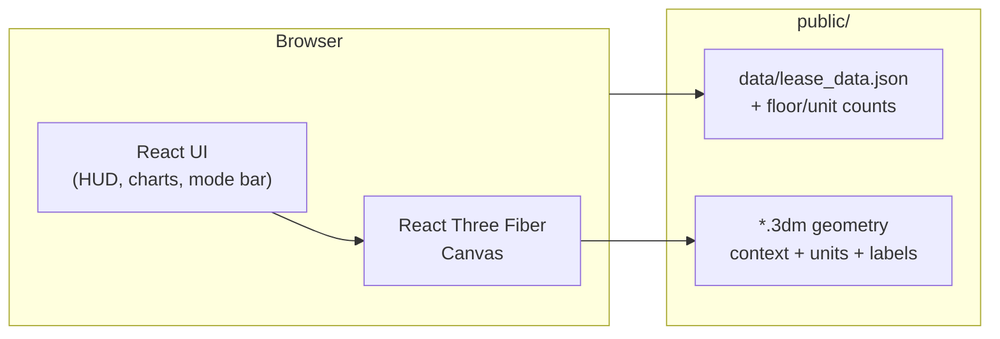
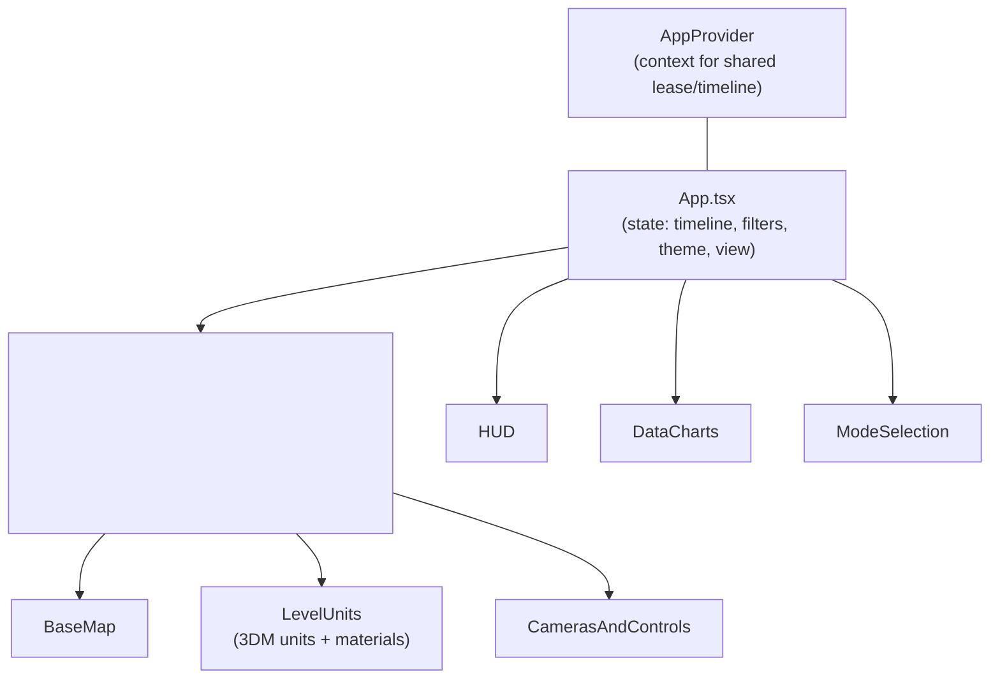
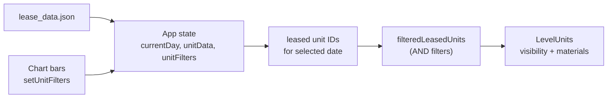
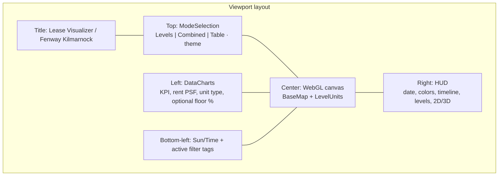

# Lease Visualizer (Rental Timeline)

Interactive **lease timeline** and **3D floor-plan** viewer for multi-level residential inventory. Scrub dates to see which units are leased, explore **Levels** or **Combined** site context, switch **2D / 3D**, and use **charts** to filter units by **rent per SF** and **unit type**. Built for the **Fenway Kilmarnock** dataset; assets and JSON live under `public/`.

---

## Overview

| | |
|--|--|
| **What it does** | Binds `lease_data.json` to Rhino-exported **3DM** unit geometry, drives occupancy and styling from the selected calendar day, and surfaces KPIs and distribution charts. |
| **Primary views** | **Levels** (per-floor 3D/2D), **Combined** (whole site), **Table** (tabular lease data). |
| **Stack** | React 19, Vite 7, TypeScript, **React Three Fiber** + **three.js**, **@react-three/drei**. |

---

## Screenshots

**Main canvas (3D) with HUD, charts, and Sun/Time**



*Representative view of the dark-theme layout: mode bar, data charts, Sun/Time dock, and right-hand HUD over the 3D scene.*

---

## Features

- **Timeline** — Day index mapped to calendar dates from the earliest lease in the dataset; slider in the HUD.
- **Occupancy** — Units reflect leased vs available for the selected date; leased units pick up highlight colors.
- **Color modes** — e.g. lease-date gradient vs **unit type** coloring (with affordable/unit-type palettes).
- **3D / 2D** — Perspective vs orthographic cameras and appropriate controls (`CamerasAndControls`).
- **Multi-floor** — Levels **L1–L8**; unit meshes and labels loaded from `public/floor_units/` and `public/unit_texts/`.
- **Charts & filters** — Rent **$/SF** buckets and **unit type** bars; clicks add filters; filters **combine with AND** and appear as removable tags (mode bar and Sun/Time area). **Combined** mode can include floor lease distribution.
- **Unit type totals** — Optional **Leased / Total** view using stable totals from `public/data/uniTypeCount.json`.
- **Selection** — Click a unit for details; optional floor-plan overlay (`FloorPlanView`). Missed pointer clears selection.
- **Lighting** — **Sun / Time** slider adjusts directional “sun” rig for shadows and fill.
- **Themes** — **Light** and **dark** UI (persisted in `localStorage`).
- **Data pipeline** — Lease JSON consumed at runtime; optional Excel conversion script under `public/scripts/`.

---

## Architecture

### System context



### Component map (simplified)



### Data flow



### UI regions (conceptual)



---

## Project layout (high level)

| Path | Role |
|------|------|
| `src/App.tsx` | Root UI, `Canvas`, chart/HUD wiring, theme, `unitFilters`, timeline state |
| `src/components/LevelUnits/` | Loads **3DM**, applies lease/material rules and filters |
| `src/components/HUD/` | Date, colors, level picker, timeline, view toggles |
| `src/components/DataCharts/` | KPI + sortable/filter charts |
| `src/utils/unitFilters.ts` | Filter predicates (unit type, rent PSF) |
| `public/data/lease_data.json` | Per-unit lease rows keyed by unit id |
| `public/data/*.json` | Aggregates (e.g. unit counts by type/floor) |
| `public/context.3dm`, `public/floor_units/`, `public/unit_texts/` | Site context and unit geometry/text layers |

---

## Working with the project

### Prerequisites

- **Node.js** (LTS recommended)

### Install

```bash
npm install
```

### Development

```bash
npm run dev
```

Open the URL Vite prints (often `http://localhost:5173/`; with a nested `base` it may include a path segment). Wait for the loading screen while **3DM** assets parse.

### Production build

```bash
npm run build
npm run preview
```

### Lint

```bash
npm run lint
```

### Updating lease data

- Replace or regenerate `public/data/lease_data.json` (shape should match `LeaseRow` in `src/types/lease.ts`).
- For spreadsheet-driven workflows, see `public/scripts/excel-to-json.ts` and run it in your own toolchain as needed.

---

## Tech stack

- **Build:** Vite, TypeScript
- **UI:** React 19
- **3D:** three.js, @react-three/fiber, @react-three/drei
- **Data:** `fetch` of static JSON; `read-excel-file` available for scripts

---

## License / data

Project is **private** (`package.json`). Building geometry and lease records are **project-specific**; do not redistribute without permission.
